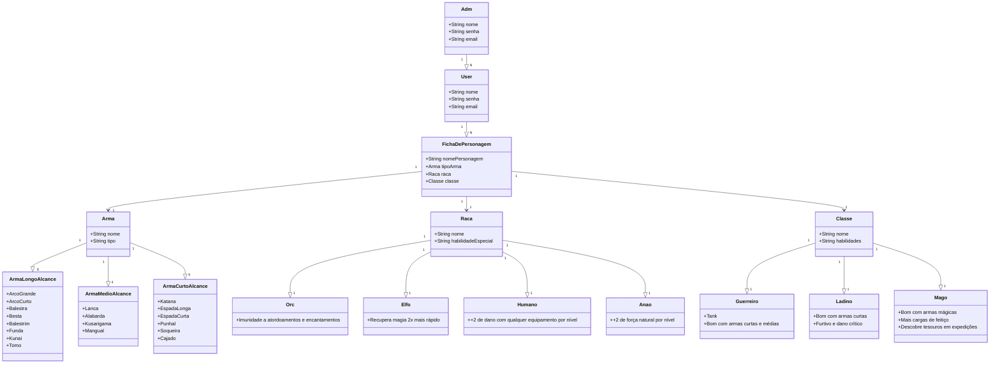

## Este projeto é Com base No projeto da Santander da DIO 

## Diagrama de Classes.

```mermaid
classDiagram
    class User {
        +String nome
        +String senha
        +String email
    }

    class Adm {
        +String nome
        +String senha
        +String email
    }

    class FichaDePersonagem {
        +String nomePersonagem
        +Arma tipoArma
        +Raca raca
        +Classe classe
    }

    class Arma {
        +String nome
        +String tipo
    }

    class ArmaLongoAlcance {
        +ArcoGrande
        +ArcoCurto
        +Balestra
        +Besta
        +Balestrim
        +Funda
        +Kunai
        +Tomo
    }

    class ArmaMedioAlcance {
        +Lanca
        +Alabarda
        +Kusarigama
        +Mangual
    }

    class ArmaCurtoAlcance {
        +Katana
        +EspadaLonga
        +EspadaCurta
        +Punhal
        +Soqueira
        +Cajado
    }

    class Raca {
        +String nome
        +String habilidadeEspecial
    }

    class Orc {
        +Imunidade a atordoamentos e encantamentos
    }

    class Elfo {
        +Recupera magia 2x mais rápido
    }

    class Humano {
        ++2 de dano com qualquer equipamento por nível
    }

    class Anao {
        ++2 de força natural por nível
    }

    class Classe {
        +String nome
        +String habilidades
    }

    class Guerreiro {
        +Tank
        +Bom com armas curtas e médias
    }

    class Ladino {
        +Bom com armas curtas
        +Furtivo e dano crítico
    }

    class Mago {
        +Bom com armas mágicas
        +Mais cargas de feitiço
        +Descobre tesouros em expedições
    }

    %% Relacionamentos com cardinalidade
    User "1" --|> "N" FichaDePersonagem
    Adm "1" --|> "N" User
    FichaDePersonagem "1" --> "1" Arma
    FichaDePersonagem "1" --> "1" Raca
    FichaDePersonagem "1" --> "1" Classe

    Arma "1" --|> "8" ArmaLongoAlcance
    Arma "1" --|> "4" ArmaMedioAlcance
    Arma "1" --|> "6" ArmaCurtoAlcance

    Raca "1" --|> "1" Orc
    Raca "1" --|> "1" Elfo
    Raca "1" --|> "1" Humano
    Raca "1" --|> "1" Anao

    Classe "1" --|> "1" Guerreiro
    Classe "1" --|> "1" Ladino
    Classe "1" --|> "1" Mago

```
